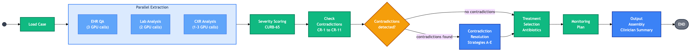
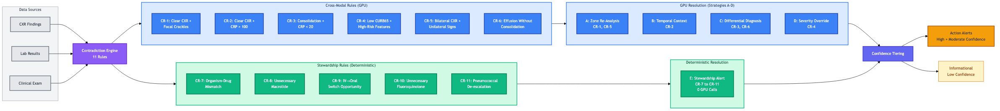
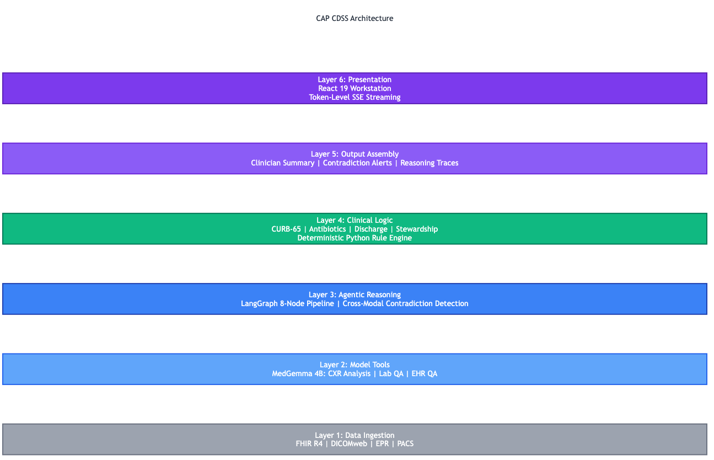
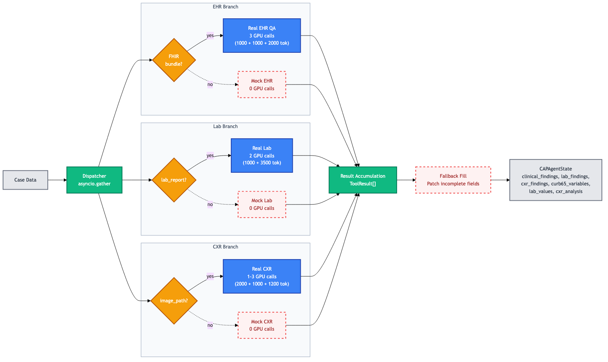
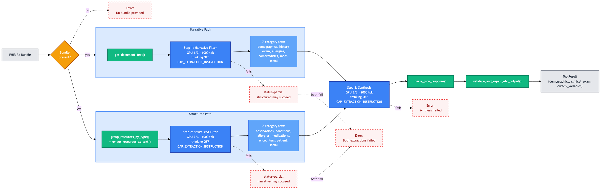
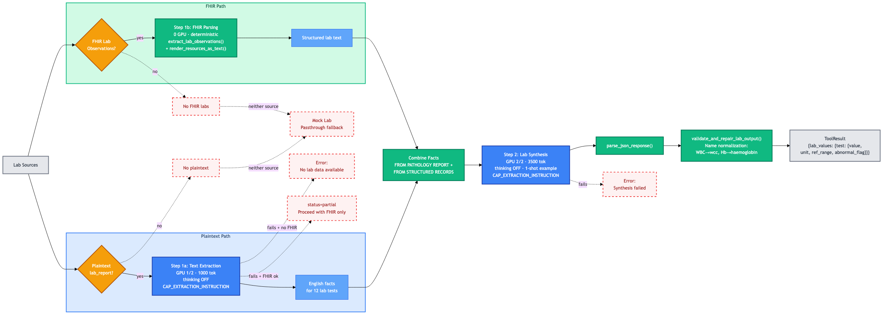
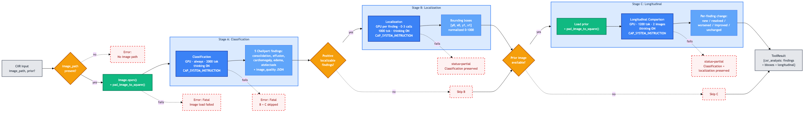
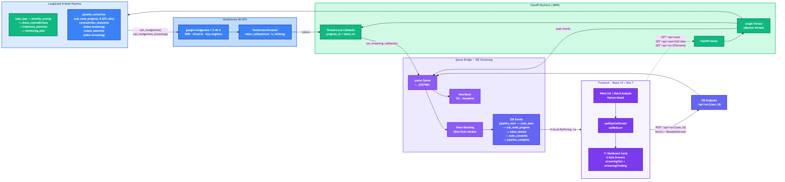
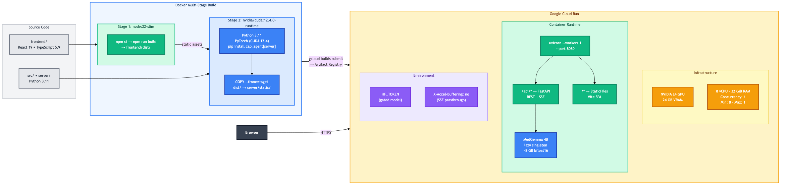

# CAP-CDSS: Agentic Cross-Modal Contradiction Detection for Community-Acquired Pneumonia

**An 8-node LangGraph agent that uses MedGemma 4B to detect and resolve contradictions across chest X-rays, lab results, and clinical examination**




---

## The Problem

When a patient presents to the emergency department with suspected pneumonia, clinicians must synthesise data from three distinct modalities -- chest X-ray imaging, blood test results, and bedside clinical examination -- typically within a 4-hour assessment window. Each modality tells part of the story, but no single one is definitive.

Sometimes, these modalities contradict each other. A chest X-ray may appear clear despite focal crackles on auscultation and a CRP of 180 mg/L. A low CURB65 score may mask genuine severity in an immunosuppressed patient. An organism may be identified on culture that the empirical antibiotic does not cover. These contradictions represent genuine diagnostic uncertainty that affects treatment decisions, admission disposition, and patient safety.

Current clinical decision support tools process each modality in isolation. They score severity from structured data, or classify X-ray findings from images, but they do not reason across modalities to detect when the data tells conflicting stories. CAP-CDSS bridges this gap with an agentic pipeline that integrates all three data streams, detects cross-modal contradictions, resolves them using MedGemma's medical reasoning capabilities, and delivers confidence-weighted recommendations with full reasoning traces.

---

## What CAP-CDSS Does

- **Multi-modal analysis** -- Three MedGemma-powered tools process chest X-ray images, laboratory reports, and clinical examination findings from FHIR R4 bundles
- **11 contradiction rules** detecting cross-modal inconsistencies (6 cross-modal + 5 antibiotic stewardship), each with defined confidence thresholds
- **5 resolution strategies** -- 4 GPU-based strategies (zone re-analysis, temporal context, differential diagnosis, severity override) and 1 deterministic stewardship pathway
- **Evidence-based clinical logic** -- CURB65 severity scoring, severity-stratified antibiotic selection with penicillin allergy stratification, discharge criteria, and IV-to-oral switch assessment
- **Confidence-weighted alerts** -- High/moderate confidence findings require clinical action; low confidence findings are flagged as informational
- **Temporal monitoring** -- 48-hour CRP trends, treatment response assessment, and Day 3-4 review with IV-to-oral switch criteria
- **Full reasoning traces** 
- **Real-time Clinical Workstation** with token-level SSE streaming, ward list management, and batch analysis

---

## Architecture

### Pipeline

The agent is an 8-node LangGraph pipeline with conditional routing. After checking for contradictions, the pipeline branches: if contradictions are detected, MedGemma resolves them before treatment selection; otherwise, treatment proceeds directly. Up to 9 GPU calls per full pipeline run (3 EHR + 2 Lab + 3 CXR + 1 contradiction resolution).


### Contradiction Detection and Resolution

Eleven rules detect contradictions across imaging, laboratory, and clinical data. Six cross-modal rules (CR-1 through CR-6) use MedGemma for resolution via Strategies A-D. Five stewardship rules (CR-7 through CR-11) resolve deterministically via Strategy E with zero GPU cost.



### 6-Layer Architecture

The system separates concerns across six layers, ensuring that clinical logic remains deterministic and auditable while model inference is confined to structured tool interfaces.



| Layer | Responsibility | Technology |
|-------|---------------|------------|
| 1. Data Ingestion | Clinical notes, labs, CXR from EPR/PACS | FHIR R4, DICOMweb |
| 2. Model Tools | MedGemma as callable tools: CXR analysis, lab interpretation, EHR QA | Structured prompts with JSON output |
| 3. Agentic Reasoning | Cross-modal contradiction detection and resolution | LangGraph + MedGemma |
| 4. Clinical Logic | CURB65, antibiotic selection, discharge criteria | Deterministic Python rule engine |
| 5. Output Assembly | Clinician summary, contradiction alerts, reasoning traces | Template engine with source attribution |
| 6. Presentation | Clinical workstation with real-time streaming | React 19, Vite 7, Tailwind 4, shadcn/ui |

### Parallel Extraction

The `parallel_extraction` node dispatches three MedGemma tools concurrently via `asyncio.gather`. Each tool checks whether its input modality is available (FHIR bundle, lab report, CXR image) and routes to either a real GPU-powered pipeline or a zero-cost mock fallback.



### EHR QA Pipeline

The EHR QA tool runs a 3-step pipeline over FHIR R4 bundles: narrative filtering (clerking notes), structured filtering (observations, allergies, conditions), and synthesis into CURB65 variables, demographics, and clinical exam findings. All 3 GPU calls use the lightweight `CAP_EXTRACTION_INSTRUCTION` with thinking disabled.



### Lab Extraction Pipeline

The Lab tool supports dual-source input — plaintext pathology reports and FHIR lab observations — merging facts from both before synthesizing into structured JSON. A 1-shot example with divergent test names prevents the model from parroting template values.



### CXR Analysis Pipeline

The CXR tool runs a 3-stage imaging pipeline: classification of 5 CheXpert conditions, anatomical localisation with bounding boxes for positive findings, and longitudinal comparison against prior CXRs. Unlike the extraction tools, CXR stages use the full `CAP_SYSTEM_INSTRUCTION` with thinking enabled.



### Technical Architecture

The system is a full-stack application with real-time streaming from GPU inference to browser. The frontend communicates via REST endpoints and Server-Sent Events. A queue bridge pattern decouples the LangGraph graph thread from the SSE generator, with 50ms token batching to reduce TCP overhead and 15-second heartbeats to prevent Cloud Run proxy timeouts.



---

## Quick Start

### Local development (no GPU required)

```bash
git clone https://github.com/HP-00/MedGemma-Pneumonia-Agent.git
cd MedGemma-Pneumonia-Agent
pip install -e ".[dev]"
pytest -v --tb=short          # 556 tests, all pass without GPU
```

### Full pipeline with Clinical Workstation (GPU required)

```bash
pip install -e ".[dev,server]"
./dev.sh                       # Backend on :8000 + Frontend on :5173
```

### Google Colab (recommended for GPU inference)

All 9 notebooks run on Colab with a T4 GPU. Install from the repository:

```python
pip install git+https://github.com/HP-00/MedGemma-Pneumonia-Agent.git@main
```

See the [Notebooks](#notebooks) section for direct Colab links.

---

## Demo Cases

Five synthetic patient cases cover the full spectrum of CAP presentations, each with a complete FHIR R4 bundle, clerking note, lab report, and chest X-ray metadata.

| Case | Patient | Presentation | Key Features |
|------|---------|-------------|-------------|
| `cxr_clear` | Margaret Thornton, 50F | 4-day productive cough, fever, pleuritic pain | Left basal consolidation with small effusion, standard CAP pathway |
| `cxr_bilateral` | Harold Pemberton, 65M | Worsening dyspnoea, confusion | Bilateral infiltrates, high severity, atrial fibrillation |
| `cxr_normal` | Susan Clarke, 50F | Acute cough, fever, raised CRP | Normal CXR with raised inflammatory markers -- triggers CR-2 |
| `cxr_subtle` | David Okonkwo, 50M | 3-day cough, low-grade fever | Subtle radiological findings, mild clinical signs |
| `cxr_effusion` | Patricia Hennessy, 65F | Progressive dyspnoea, pleuritic pain | Pleural effusion, immunosuppressed on methotrexate -- triggers CR-4 and CR-6 |

---

## MedGemma Tools

Three structured tools wrap MedGemma 4B (`google/medgemma-1.5-4b-it`) for medical data extraction. Each tool has a defined input/output contract and returns structured JSON.

| Tool | Input | GPU Calls | Output |
|------|-------|-----------|--------|
| **EHR QA** | FHIR R4 Bundle (observations, allergies, conditions) | 3 | CURB65 variables, patient demographics, clinical exam findings, allergy details |
| **Lab Analysis** | Plaintext lab report + FHIR observations | 2 | Lab values (CRP, urea, WCC, eGFR), structured interpretation |
| **CXR Analysis** | Chest X-ray image (896x896 normalised) | 1-3 | Consolidation detection, anatomical localisation, longitudinal comparison |

The EHR QA tool uses a 3-step pipeline (narrative filter, structured filter, synthesise). The Lab tool uses a 2-step pipeline (extract facts, synthesise JSON). The CXR tool uses a 3-stage pipeline (classification, localisation, longitudinal comparison with prior). All tools fall back to mock extraction when their input modality is unavailable, enabling graceful degradation.

---

## Contradiction Detection

The contradiction engine implements 11 rules organised into two categories.

**Cross-modal contradictions (CR-1 to CR-6)** detect inconsistencies between imaging, laboratory, and clinical examination findings. These are resolved by MedGemma using one of four strategies:

- **Strategy A** (CR-1, CR-5): Zone-specific CXR re-analysis with image quality assessment
- **Strategy B** (CR-2): Temporal context analysis -- CXR findings may lag 12-24 hours behind clinical onset
- **Strategy C** (CR-3, CR-6): Differential diagnosis screening when findings suggest alternative pathology
- **Strategy D** (CR-4): Severity override reasoning for patients with risk factors masked by low scores

**Antibiotic stewardship contradictions (CR-7 to CR-11)** detect prescribing inconsistencies. These resolve deterministically (Strategy E) with zero GPU cost:

- CR-7: Antibiotic does not cover identified organism
- CR-8: Macrolide prescribed without atypical pathogen evidence (exempt at high severity)
- CR-9: IV antibiotics beyond 48 hours despite oral tolerance and clinical improvement
- CR-10: Fluoroquinolone prescribed when penicillin allergy is intolerance only
- CR-11: Pneumococcal antigen positive but broad-spectrum antibiotic continues

Every contradiction carries a confidence level (high, moderate, or low) that determines its clinical presentation: high and moderate confidence findings appear as actionable alerts; low confidence findings appear as informational notes.

For full rule definitions, see [`docs/contradiction_rules.md`](docs/contradiction_rules.md).

---

## Clinical Workstation

The frontend is a React 19 application built with Vite 7, Tailwind 4, and shadcn/ui. It provides three primary views:

- **Ward List** -- Patient overview with severity indicators, pending actions, and batch analysis triggers
- **Batch Analysis** -- Run the pipeline across multiple patients with progress tracking and shimmer animations
- **Patient Detail** -- Full pipeline output with dashboard cards, CXR viewer, lab heatmap, CRP trend chart, CURB65 radar, vital signs timeline, and FHIR data drawers

Token-level SSE streaming shows MedGemma's reasoning in real-time during contradiction resolution and output assembly. Sub-node progress events track each GPU call within the extraction phase. A 50ms token batching window and 15-second heartbeat ensure smooth streaming through Cloud Run's reverse proxy.

---

## Notebooks

Nine Colab notebooks demonstrate different aspects of the system, from end-to-end pipeline execution to focused deep-dives on individual capabilities.

| # | Notebook | Theme |
|---|----------|-------|
| 1 | [Full Pipeline Demo](notebooks/01_full_pipeline_demo.ipynb) | Complete pipeline run across 4 timepoints (T=0, T=48h, CR-10 safety, Day 3-4 monitoring) |
| 2 | [Benchmark Evaluation](notebooks/02_benchmark_evaluation.ipynb) | 49-case benchmark with 8 evaluators and regression detection |
| 3 | [CXR Imaging Analysis](notebooks/03_cxr_imaging_analysis.ipynb) | 12 RSNA chest X-rays through the 3-stage CXR pipeline with bounding boxes |
| 4 | [Cross-Modal Contradictions](notebooks/04_cross_modal_contradictions.ipynb) | CR-1 through CR-6 with Strategies A-D and MedGemma reasoning |
| 5 | [Antibiotic Stewardship](notebooks/05_antibiotic_stewardship.ipynb) | CR-7 through CR-11, Strategy E, penicillin allergy safety |
| 6 | [Clinical Severity Scoring](notebooks/06_clinical_severity_scoring.ipynb) | 15 CURB65 boundary cases mapping severity to treatment selection |
| 7 | [Temporal Patient Journey](notebooks/07_temporal_patient_journey.ipynb) | 3 timepoints with CRP trend analysis, discharge criteria, FHIR extraction |
| 8 | [Reasoning Traces](notebooks/08_reasoning_traces.ipynb) | Thinking tokens, Strategies A-E, confidence mapping |
| 9 | [Safety Overrides](notebooks/09_safety_overrides.ipynb) | Sepsis override, allergy safety, missing data handling, oral intolerance |

Each notebook is generated programmatically from a Python script (`scripts/_generate_<name>_notebook.py`) and tested for parity via sync tests.

---

## Benchmarking

The benchmark harness evaluates pipeline output against ground truth across 8 metrics.

| Evaluator | Measures | Scoring |
|-----------|----------|---------|
| Severity accuracy | CURB65 score + severity tier | Exact match |
| Antibiotic concordance | Recommendation vs expected | Substring match |
| Contradiction recall | Detected vs expected contradictions | Proportion found |
| Contradiction precision | False positive rate | True positives / total detected |
| CXR consolidation | Consolidation finding present | Binary |
| CXR localisation | Bounding box IoU vs RSNA annotations | Best-match IoU |
| Safety score | Allergy contraindications respected | Binary |
| Completeness | Output sections present (8 expected) | Coverage proportion |

Quick mode runs locally in under 10 seconds using a prompt-keyword router (no GPU). Full mode runs on Colab with real MedGemma inference. Regression detection compares against a stored baseline with per-metric tolerance thresholds.

```bash
python -m benchmark_data.evaluation.run_benchmark --quick    # Local, no GPU
```

---

## Deployment

### Docker

```bash
docker build -t cap-cdss .
docker run -p 8000:8000 --gpus all -e HF_TOKEN=hf_xxx cap-cdss
```

### Google Cloud Run (L4 GPU)

```bash
HF_TOKEN=hf_xxx ./deploy.sh
```

The Dockerfile uses a multi-stage build: Node.js builds the frontend, then a CUDA Python image serves both the FastAPI backend and static frontend assets. Single-worker uvicorn is used because MedGemma 4B fills GPU memory.



---

## Project Structure

```
src/cap_agent/
    utils/             Config constants, trace helpers
    models/            MedGemma interface, prompt builders (616L of clinical prompts)
    agent/             LangGraph nodes, graph builder, clinical logic (1,672L), state schema
    data/              Synthetic cases, FHIR parsing, extraction pipelines

benchmark_data/
    evaluation/        8 evaluators, benchmark runner, regression detection, Plotly reports

server/                FastAPI backend, SSE streaming, mock runner, demo case registry

frontend/              React 19 + Vite 7 + Tailwind 4 + shadcn/ui Clinical Workstation
    src/pages/         Ward list, batch analysis, patient detail, dashboard
    src/components/    Dashboard cards, detail views, data drawers, layout
    src/hooks/         SSE pipeline stream, batch queue, demo cases

notebooks/             9 Colab notebooks (generated from Python scripts)

tests/                 556 tests covering clinical logic, extraction, FHIR parsing,
                       graph structure, state schema, benchmarking, and notebook parity

docs/                  Architecture docs, frontend docs, streaming docs, deployment research
EVIDENCE.md            Primary evidence base (bibliography) grounding all clinical logic
```

## License

This project is licensed under [CC-BY-4.0](LICENSE).

---

## Disclaimer

**This is a research prototype developed for the MedGemma Impact Challenge. It is NOT a medical device and is NOT approved for clinical use by any regulatory authority (FDA, CE, MHRA).** All clinical outputs — including severity scores, antibiotic recommendations, contradiction alerts, CXR analysis, and lab interpretation — are **AI-generated by MedGemma 1.5 4B** and may contain errors, hallucinations, or clinically inappropriate recommendations. The system has been validated only on synthetic (simulated) data, not real patient data. All clinical decisions must be made by qualified healthcare professionals. The system is designed to support, not replace, clinical judgement.

See **[DISCLAIMER.md](DISCLAIMER.md)** for full legal terms including warranty disclaimer, limitation of liability, and regulatory status.
